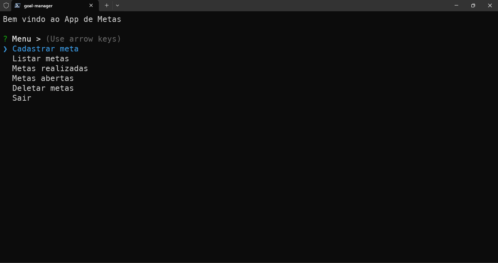

<h1 align="center">
Goal Manager
</h1>

⚙️ Desenvolvimento de um menu e as lógicas de cadastrar e listar, marcar e desmarcar as metas realizadas, apresentando metas realizadas e a realizar, deletar metas e salvar tudo isso em um arquivo. ⚙️

 

  

 

## 🛠 Tecnologias

Esse projeto foi desenvolvido com as seguintes tecnologias:

- **[Javascript](https://developer.mozilla.org/pt-BR/docs/Web/JavaScript)**
- **[NodeJS](https://nodejs.org/pt)**
- **[npm](https://www.npmjs.com/)**
- **[inquirer](https://www.npmjs.com/package/inquirer) `- Uma coleção de interfaces de usuário de linha de comando interativas comuns.`**

 

## 🎨 Layout

Você pode visualizar o layout do projeto através [DESSE LINK](#). É necessário ter conta no [Figma](https://figma.com) para acessá-lo.

 

## 📝 License

  

Esse projeto está sob a licença MIT.

 

### 👨‍💻 Autor

 
 <em>Ciro Batista da Silva<em>
 
  

 
👋🏽 Entre em contato!

 

